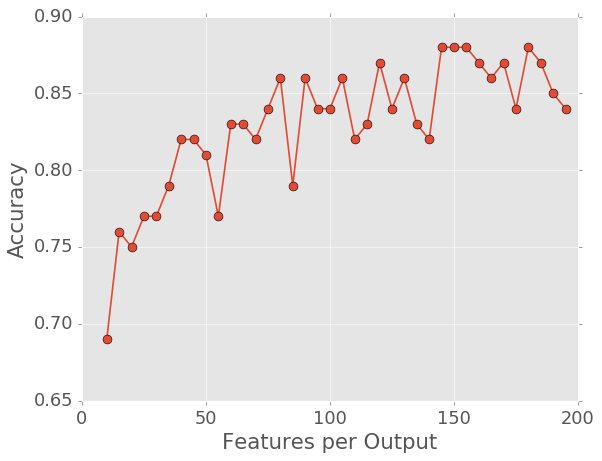

# MNIST

## 28 Input(rows), 10 output

LDA is used here to classify data.

60000 data sets, with ground initial state and row/column data both fed in.

A pre-activated initial state did not improve the accuracy:

