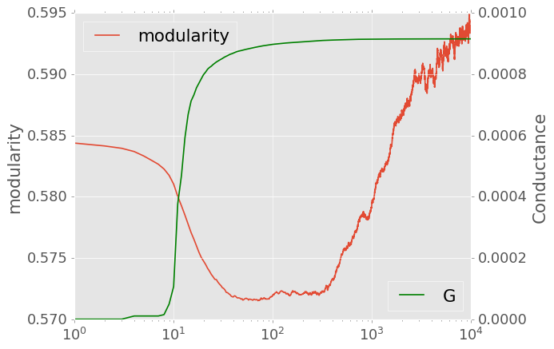
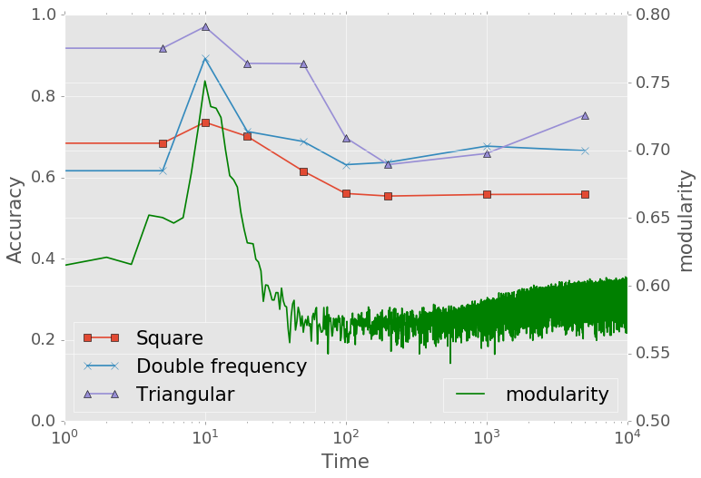

# Dual Task

## Hypothesis

A person trained for certain tasks might be able to do better in some related tasks or worse in other ones. For example, a person who speaks Portuguese, like Ronaldo, might find it very easy to learn Spanish. Similarly, in the context of a network, the scenario will be - if a network is trained to do one task first, will its ability to do other tasks be affected?

Meanwhile, a person can be at different levels of learning things, like from a beginner to a professional. Back to the example of learning language. It is obvious that a fluent Portuguese speaker will learn Spanish faster than a Portuguese beginner. (But if he is into one language too much, it will be hard for him to learn some other unrelated ones, like Chinese. $\leftarrow$ Not sure if this statement in parenthesis is true.)

Modularity can be one measure of a network that somehow interprets its learning level. Throughout the activation of a network, its modularity curve (also conductance and TE) will clearly have certain states - the starting stage, then a big drop, and finally increase again. Then the question comes as - if one train the network to do a first task, and extract the network state's from different time points of that training, then start training the network to do a second task from these extraced states, will the results from the second task be different according to different initial conditions?

-----

## The first task

The first task is Mackey-Glass forecasting. Start activate the network by the same way as what we did in [forecast](forecast.md) task. The modularity curve is shown in the following figure. 

An intuitive way of pick time points will be 

| Time point | State                          |
| ---------- | ------------------------------ |
| 0          | Unaffected Network             |
| 5          | Starting stage (minor changes) |
| 10         | About to activate              |
| 20         | The drop                       |
| 50         | The drop about to finish       |
| 100        | Bottom of the curve            |
| 200        | Bottom                         |
| 1000       | Increase again                 |
| 5000       | End of training period         |

-----

The second task is [non-linear signal transformation](non_linear_trans.md). 

The non linear transformation accuracy is an average of 50 repetitions.

If one start training for the second task from when the modularity is just about to drop, the accuracy from second task is significantly improved. And more training on the first task (starting second task from later states) will actually harm the accuracy of the second task. 

-----

## Guimera

