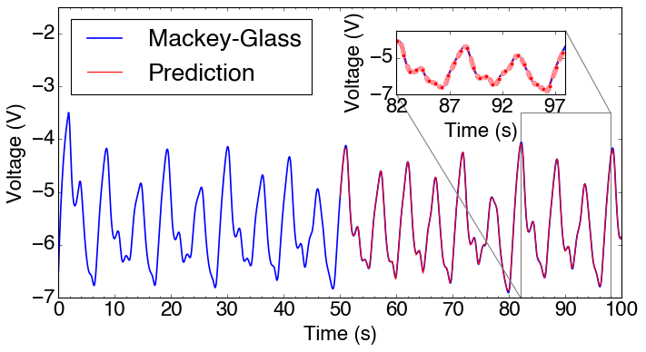
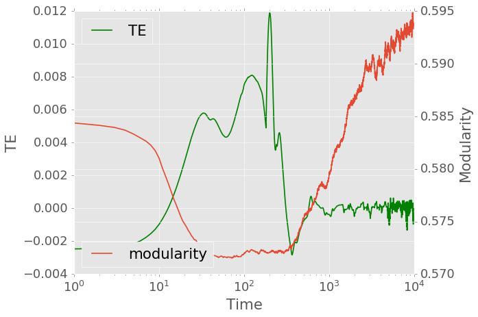
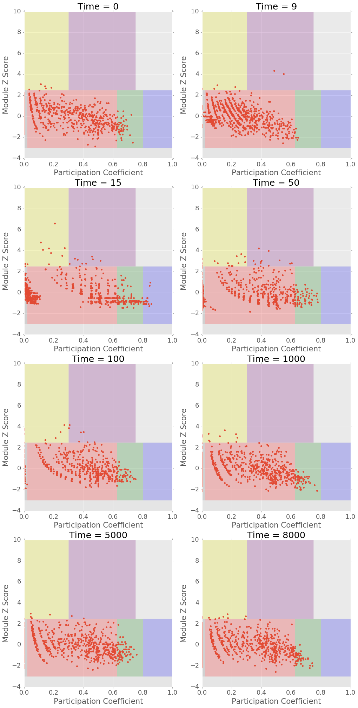

# Forecast Analysis

## The task

Parameters:

```python
multi, shift, training_ratio, past_steps, cheat_period, cheat_steps = -3, -2.9, 0.5, 30, 60, 30
```

20 left most wires are connected to an external input node and they are getting same signal from input. Similarly 20 right most wires are connected to an external drain. The voltage differences between these right most wires and the external drain are treated as the readouts. (Use this kind of set up to get most of the network involved and activated.)

First 5000 time steps are the training period of the network. $\tau = 50$ Mackey-Glass signal is fed in to the external input. Then for the forecasting period, 30 steps of history states of the readout nodes is included in the regression (For higher degree of freedom). For a period of 60 time steps, 30 data points are predicted, then real Mackey-Glass signal is fed in again to renormalize the network.

In general, the prediction equation reads:

$$u_t = \vec{w} \cdot (1, u_{t-1}, \vec{S}_{t-1}, \vec{S}_{t-2}, .. ,\vec{S}_{t-30}),$$ 

where $u_{i}$ is the input signal at time $i$, $\vec{S}_i$ is a 20 by 1 vector representing the network's readout at time $i$ and $\vec{w}$ is the weight with shape of 602 by 1. 

-----

## Forecast Result

With accuracy of 97.8%, the result looks like:



-----

## Conductance time-series

On semilogx scale, It's clear that the activation of network and drop of modularity coincide pretty well with respect to time. One thing to notice is that the activation and the modularity drop are both happening in the training period.

Also, I have a hypothesis here as:

Since the most of the network is involved in the activation, we don't observe a spike of modularity before it's big drop, which is actually observed for the same network with single source/drain.


-----

## Modularity, TE Curve

Again, on semilogx scale, TE peak and modularity drop line up pretty well with respect to time.



-----

## z-p space

In the module z score - participation coefficient space, things are lining up with neuro-science conjectures as well. From starting point to around the activation of the network (which also means TE spike, modularity drop, the network's 'learning'), the data points are spreading out. Then these data points will condense again after 'learning' is finished.

