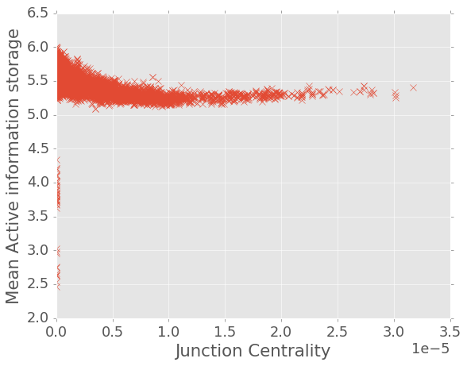

# Junction AIS

Throughout the activation of ASNs, the voltages across the junctions are the key factors of collective dynmaics. Regarding the memory property exhibited by junctions, it's necessary to test the junctions' active information storage.

* Local Active information storage (https://www.frontiersin.org/articles/10.3389/fninf.2014.00001/full):

$$
a(x_t) = i (\textbf{x}_{t-1}^{k-}; x_{t}) = \log \frac{p_t(x_t | \textbf{x}_{t-1}^{k-})}{p_t(x_t)}
$$

* Junction (edge) current-flow centrality (http://kim246.wwwdns.kim.uni-konstanz.de/publications/bf-cmbcf-05.pdf):

$$
c_{CB}(e) = \frac{\sum_{s \neq t \in V}\tau_{st}(e)}{(n-1)(n-2)}
$$

-----

Take time average of each edge's local active information storage $ \langle a(e)\rangle _t$ and plot it versus $c_{CB}(e)$ (measured at $t=0$). For 50 repetitions with different source/ drain pairings (same distance between source and target), the plot looks as follows.

-----

In graphical representation of the network, the junctions closer to source/ target tend to have higher centrality. And therefore exhibit stronger dynamics (get involved in all sorts of redistributions). Thus these junctions will come with lower information storage. On the other hand, switches with lower centralities are more likely to be more stable. Thus the information storage would be a bit higher.