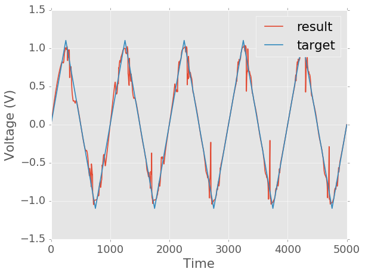
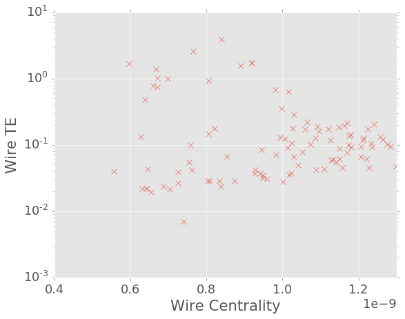
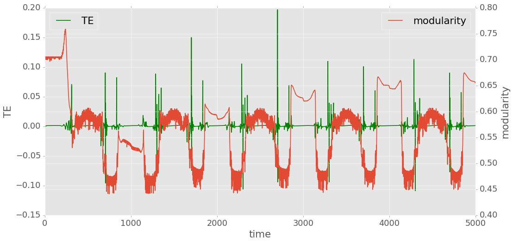

# Non Linear Trans

## The task

A sin wave is transferred into a triangular wave. Accuracy is 87.6% by RNMSE.

-----

## TE vs node centrality

==**Node TE vs centrality is not showing stuff as we expected.**==

The problem might come from signal type.

------

## Modularity time series

Modularity is behaving exacly as expected. In general activation test, modularity will experience a drop when the network is turning on. Meanwhile TE will have a peak. This scenario has been observed in our model and also in real brain networks/ ANN (validate with Mac). Here all the modularity drops come with a TE spike. The timing might not be perfectly lined up but in general it already shows a trend.

