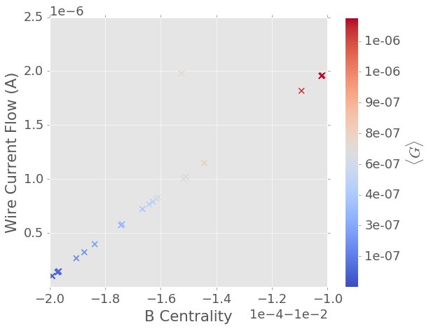
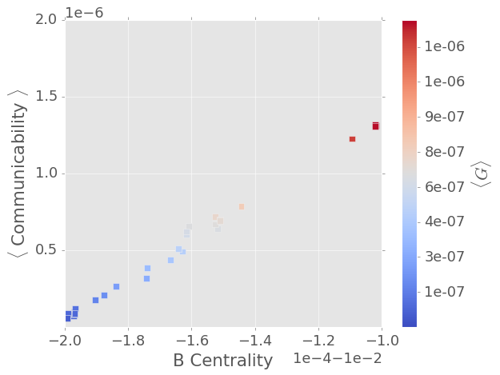
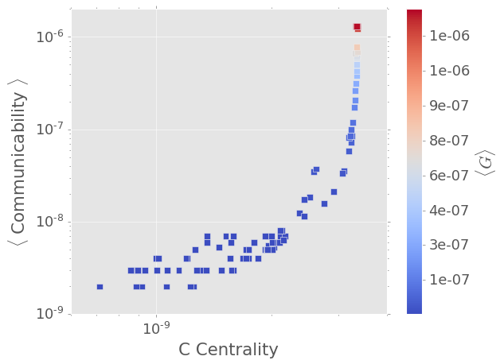
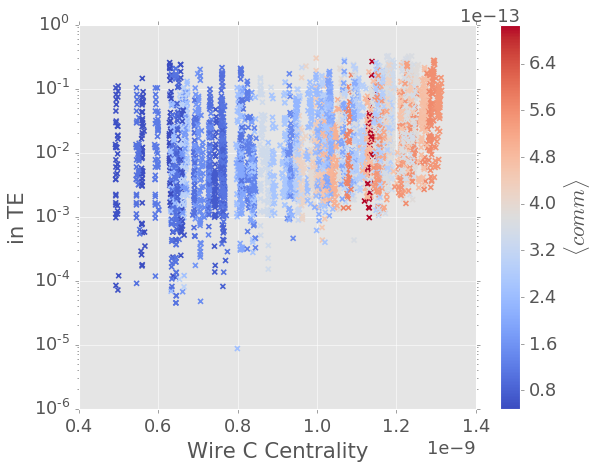
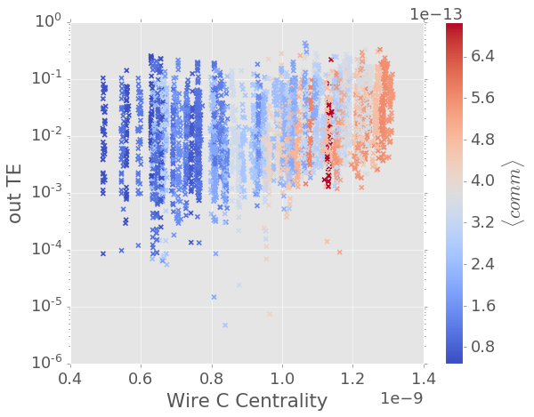

# Wire Centrality

## Betweenness

$$
c_{CB}(e) = \frac{\sum \limits_{s \neq t \in V}\tau_{st}(e)}{(n-1)(n-2)}
$$

### Current flux on a wire:

### Comm

$$
COMM = \exp(D^{-1/2}WD^{-1/2})\\
D = \text{diag}(d_i), \qquad d_i = \sum_{k=1}^N a_{ik}\\
COMM_{node} = \sum_{k=1}^N a_{ik}, \qquad \text{for }  i \neq k
$$

-----

## Closeness

### Comm

### in TE

### out TE

